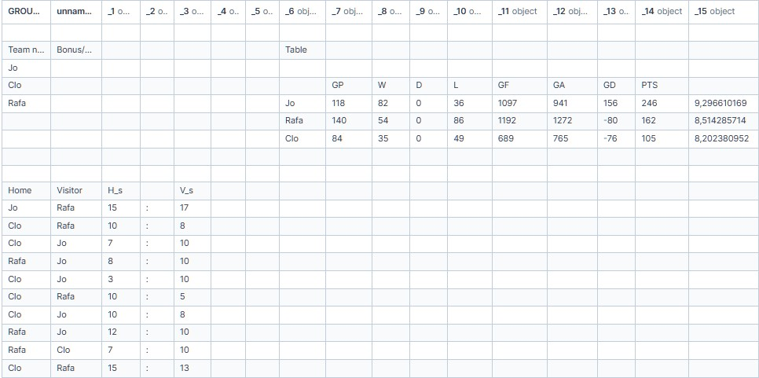
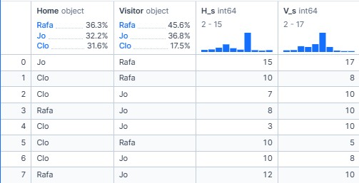

+++
title = 'Baby-foot statistics'
date = 2024-09-28T13:13:39+02:00
draft = false
summary = "Statistiques from baby-games played with friends"
author = "Joseph Vankelegom"
+++

## Introduction

During the year 2024, I started playing baby-foot with friends.
After some time we obviously became quite competitive about and we wanted to know our personal performance.
From this we started using an already existing excel to record our games.
After some time I decided to take some time to create fun graphs and statistique to look at, that how I did it.


I decided to make it online to allow my friend to be able to use it, from this idea I decided to use Deepnote,
Visit the [Notebook](https://deepnote.com/workspace/vanjotom-690650e7-21e6-4e93-ab8c-6a827642f688/project/BabyFoot-4a2ef5da-34d9-49ae-ac9a-5186cf57ff1d/notebook/CleanCsv-7f49f2b3e4e64f3fb8a2e2f49c1d9c11)!


I created two main files, one were I cleaned to excel from useless information to make it easier to use, the second one is were I make all the calculation.

## Part 1, look at the file.
Let's get a look at the file:
```python
import pandas as pd
df = pd.read_csv('babyfoot.csv', delimiter=';')
df.head()
```


As we can see there is a lot of useless information, there were already some calculation that we made but I didn't want to use them, the next step was to clean the excel.

```python
import pandas as pd
df = pd.read_csv('baby2.csv', delimiter=',',skiprows=10)
print('Columns before dropping NaNs:', df.columns)

# Drop columns that are completely NaN
cleaned_df = df.dropna(axis=1, how='all')

print('Columns after dropping NaNs:', cleaned_df.columns)

# Drop columns 'Unnamed: 3' and 'Unnamed: 18' (unknown columns)
cleaned_df = df.loc[:,['Home', 'Visitor', 'H_s', 'V_s']]

# Checking the columns after dropping NaN columns
remaining_columns = cleaned_df.columns
print('Columns after dropping NaNs and unknown columns:', remaining_columns)

cleaned_df.to_csv('babyfoot_cleaned.csv', index=False, sep=';')

cleaned_df
```

After erasing all the data that I didn't want I ended up with this :


As we can see deepnote already create some data about each row, and it give some ideas about what I wanted to achieve with this data.


## Part 2, extract the information
```python
# Calculate the win rate for each player

# Initialize a dictionary to store the win and total game counts for each player
player_stats = {}
players_history = {}
players_history_goals = {}
cancha = {'home': {}, 'away': {}, 'home_wins' : 0, 'total_games': 0}

# Iterate through each row in the cleaned dataframe
for index, row in cleaned_df.iterrows():
    home_player = row['Home']
    visitor_player = row['Visitor']
    home_score = row['H_s']  # Fix variable name
    visitor_score = row['V_s']
    
    # Initialize player if not already present
    if home_player not in player_stats:
        player_stats[home_player] = {'wins_home': 0, 'wins_away': 0, 'losses_home': 0, 'losses_away': 0, 'longest_streak':0, 'actual_streak':0, 'total_games': 0}
    if visitor_player not in player_stats:
        player_stats[visitor_player] = {'wins_home': 0, 'wins_away': 0, 'losses_home': 0, 'losses_away': 0, 'longest_streak':0, 'actual_streak':0, 'total_games': 0}
    
    if home_player not in player_stats[visitor_player]:
        player_stats[visitor_player][home_player] = {'wins_home': 0, 'wins_away': 0, 'losses_home': 0, 'losses_away': 0, 'longest_streak':0, 'actual_streak':0, 'total_games': 0}
    if visitor_player not in player_stats[home_player]:
        player_stats[home_player][visitor_player] = {'wins_home': 0, 'wins_away': 0, 'losses_home': 0, 'losses_away': 0, 'longest_streak':0, 'actual_streak':0, 'total_games': 0}
    
    if home_player not in cancha['home']:
        cancha['home'][home_player] = 0
    if visitor_player not in cancha['away']:
        cancha['away'][visitor_player] = 0
    
    if home_player not in players_history:
        players_history[home_player] = {"total": []}
    if visitor_player not in players_history:
        players_history[visitor_player] = {"total": []}
    
    if home_player not in players_history[visitor_player]:
        players_history[visitor_player][home_player] = []
    if visitor_player not in players_history[home_player]:
        players_history[home_player][visitor_player] = []

    if home_player not in players_history_goals:
        players_history_goals[home_player] = {"total": []}
    if visitor_player not in players_history_goals:
        players_history_goals[visitor_player] = {"total": []}

    if home_player not in players_history_goals[visitor_player]:
        players_history_goals[visitor_player][home_player] = []
    if visitor_player not in players_history_goals[home_player]:
        players_history_goals[home_player][visitor_player] = []


    # Increment total games for both players
    player_stats[home_player]['total_games'] += 1
    player_stats[visitor_player]['total_games'] += 1

    player_stats[home_player][visitor_player]['total_games'] += 1
    player_stats[visitor_player][home_player]['total_games'] += 1

    cancha['home'][home_player] += 1
    cancha['away'][visitor_player] += 1

    cancha['total_games'] += 1
    
    # Increment win and loss counts
    if home_score > visitor_score:

        player_stats[home_player]['wins_home'] += 1
        player_stats[visitor_player]['losses_away'] += 1

        player_stats[home_player][visitor_player]['wins_home'] += 1
        player_stats[visitor_player][home_player]['losses_away'] += 1

        player_stats[home_player]['actual_streak'] += 1
        player_stats[visitor_player]['actual_streak'] = 0

        player_stats[home_player][visitor_player]['actual_streak'] += 1
        player_stats[visitor_player][home_player]['actual_streak'] = 0

        if player_stats[home_player]['actual_streak'] > player_stats[home_player]['longest_streak']:
            player_stats[home_player]['longest_streak'] = player_stats[home_player]['actual_streak']

        if player_stats[visitor_player]['actual_streak'] > player_stats[visitor_player]['longest_streak']:
            player_stats[visitor_player]['longest_streak'] = player_stats[visitor_player]['actual_streak']
        
        if player_stats[visitor_player][home_player]['actual_streak'] > player_stats[visitor_player][home_player]['longest_streak']:
            player_stats[visitor_player][home_player]['longest_streak'] = player_stats[visitor_player][home_player]['actual_streak']

        if player_stats[home_player][visitor_player]['actual_streak'] > player_stats[home_player][visitor_player]['longest_streak']:
            player_stats[home_player][visitor_player]['longest_streak'] = player_stats[home_player][visitor_player]['actual_streak']

        cancha['home_wins'] += 1

        players_history[home_player]["total"].append(1)
        players_history[visitor_player]["total"].append(0)
        players_history[home_player][visitor_player].append(1)
        players_history[visitor_player][home_player].append(0)

        players_history_goals[home_player]["total"].append(home_score)
        players_history_goals[visitor_player]["total"].append(visitor_score)
        players_history_goals[home_player][visitor_player].append(home_score)
        players_history_goals[visitor_player][home_player].append(visitor_score)


    else:
        player_stats[home_player]['losses_home'] += 1
        player_stats[visitor_player]['wins_away'] += 1

        player_stats[home_player][visitor_player]['losses_home'] += 1
        player_stats[visitor_player][home_player]['wins_away'] += 1

        player_stats[visitor_player]['actual_streak'] += 1
        player_stats[home_player]['actual_streak'] = 0

        player_stats[visitor_player][home_player]['actual_streak'] += 1
        player_stats[home_player][visitor_player]['actual_streak'] = 0

        if player_stats[home_player]['actual_streak'] > player_stats[home_player]['longest_streak']:
            player_stats[home_player]['longest_streak'] = player_stats[home_player]['actual_streak']

        if player_stats[visitor_player]['actual_streak'] > player_stats[visitor_player]['longest_streak']:
            player_stats[visitor_player]['longest_streak'] = player_stats[visitor_player]['actual_streak']

        if player_stats[visitor_player][home_player]['actual_streak'] > player_stats[visitor_player][home_player]['longest_streak']:
            player_stats[visitor_player][home_player]['longest_streak'] = player_stats[visitor_player][home_player]['actual_streak']

        if player_stats[home_player][visitor_player]['actual_streak'] > player_stats[home_player][visitor_player]['longest_streak']:
            player_stats[home_player][visitor_player]['longest_streak'] = player_stats[home_player][visitor_player]['actual_streak']

        cancha['home_wins'] += 0

        players_history[home_player]["total"].append(0)
        players_history[visitor_player]["total"].append(1)
        players_history[home_player][visitor_player].append(0)
        players_history[visitor_player][home_player].append(1)

        players_history_goals[home_player]["total"].append(home_score)
        players_history_goals[visitor_player]["total"].append(visitor_score)
        players_history_goals[home_player][visitor_player].append(home_score)
        players_history_goals[visitor_player][home_player].append(visitor_score)


# List Players
players = player_stats.keys()
print(players)
print("player_stats : ", player_stats)

# Calculate win rates for each player
win_rates = {player: {'home': (stats['wins_home']) / (stats['wins_home'] + stats['losses_home']), 'away': (stats['wins_away']) / (stats['wins_away'] + stats['losses_away']), 'total': (stats['wins_home'] + stats['wins_away']) / (stats['total_games'])} for player, stats in player_stats.items()}
print("win_rates : ", win_rates)

# Calculate the win rate for each player for each side of the field
win_rates_confrontation = {}
for player, stats in player_stats.items():
    win_rates_confrontation[player] = {player2: {'home': stats[player2]['wins_home'] / (stats[player2]['wins_home'] + stats[player2]['losses_home']), 'away': stats[player2]['wins_away'] / (stats[player2]['wins_away'] + stats[player2]['losses_away']), '#gamesHome': (stats[player2]['wins_home'] + stats[player2]['losses_home']), '#gamesAway': (stats[player2]['wins_away'] + stats[player2]['losses_away']), 'win_home':  stats[player2]['wins_home'] , 'win_away': stats[player2]['wins_away']} for player2 in player_stats.keys() if player != player2}
    
print("win_rates_confrontation : ", win_rates_confrontation)

print("cancha : ", cancha)

print("players_history : ", players_history)

print("players_history_goals : ", players_history_goals)
```

## Part 3, Graphs Graphs and more graphs
```python
# Extract all players
players = list(win_rates_confrontation.keys())

# Print header
print(f"{'Player':<5} {'vs Player':<10} {'Home Win %':<12} {'Away Win %':<12} {'# Games Home':<12} {'# Games Away':<12} {'Win Home':<12} {'Win Away':<12}")

# Print data rows
for player1 in players:
    
    for player2 in players:
        if player1 != player2:
            data = win_rates_confrontation[player1].get(player2, {})
            home_win_percent = data.get('home', 0) * 100
            away_win_percent = data.get('away', 0) * 100
            games_home = data.get('#gamesHome', 0)
            games_away = data.get('#gamesAway', 0)
            win_home = data.get('win_home', 0)
            win_away = data.get('win_away', 0)
            print(f"{player1:<5} {player2:<10} {home_win_percent:<12.2f} {away_win_percent:<12.2f} {games_home:<12} {games_away:<12}, {win_home}, {win_away}")
```


```python
import matplotlib.pyplot as plt

# Extracting data for plotting
players = list(win_rates.keys())
home_win_rates = [win_rates[player]['home'] for player in players]
away_win_rates = [win_rates[player]['away'] for player in players]
total_win_rates = [win_rates[player]['total'] for player in players]

# Plotting the win rates
fig, ax = plt.subplots(figsize=(10, 6))


bar_width = 0.2
index = range(len(players))

bar1 = ax.bar(index, home_win_rates, bar_width, label='Home Win Rate')
bar2 = ax.bar([i + bar_width for i in index], away_win_rates, bar_width, label='Away Win Rate')
bar3 = ax.bar([i + 2 * bar_width for i in index], total_win_rates, bar_width, label='Total Win Rate')

# Adding the win rate values on top of the bars
for i in index:
    ax.text(i, home_win_rates[i] + 0.01, f'{home_win_rates[i]:.2f}', ha='center')
    ax.text(i + bar_width, away_win_rates[i] + 0.01, f'{away_win_rates[i]:.2f}', ha='center')
    ax.text(i + 2 * bar_width, total_win_rates[i] + 0.01, f'{total_win_rates[i]:.2f}', ha='center')
    # Adding side labels
    ax.text(i, home_win_rates[i] / 2, 'Home', ha='center', va='center', color='white', rotation='vertical', fontfamily='serif', fontweight='bold')
    ax.text(i + bar_width, away_win_rates[i] / 2, 'Away', ha='center', va='center', color='white', rotation='vertical', fontfamily='monospace', fontweight='bold')
    ax.text(i + 2 * bar_width, total_win_rates[i] / 2, 'Total', ha='center', va='center', color='white', rotation='vertical', fontfamily='sans-serif', fontweight='bold')

ax.set_xlabel('')
ax.set_ylabel('')
ax.set_title('Win Rates by Player and side')
ax.set_xticks([i + bar_width for i in index])
ax.set_xticklabels(players)

# Add grid lines
ax.grid(axis='y', linestyle='--', alpha=0.5)
ax.grid(axis='x', linestyle='')
ax.set_axisbelow(True)

# Remove the spines
ax.spines['top'].set_visible(False)
ax.spines['right'].set_visible(False)
ax.spines['left'].set_visible(False)

#ax.legend()

plt.show()
```