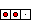
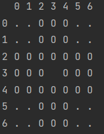

Work in progress
## Introduction
let's work on some algorithms, as a focus point for those algorithms I decided to used games,
for the first part we will start with a one player game called peg solitaire.
here is the link to the [Github](https://github.com/JosephVankelegom/peg_solitaire)!

### Peg solitaire:

Peg solitaire is a board game for one player involving movement of pegs on a board with holes.
The standard game fills the entire board with pegs except for the central hole. The objective is,
making valid moves, to empty the entire board except for a solitary peg in the central hole. ref wikipedia
A valid move is to jump a peg orthogonally over an adjacent peg into a hole two positions away and then to remove the jumped peg.
 (from [here](https://www.mathematische-basteleien.de/solitaire.htm))

the first part is to recreate the game:



there are three kinds of spaces:
1) "0", if there is a peg in that hole
2) " ", if there is no peg in that hole
3) ".", if it's not a hole.

to make a move the player will need to input the coordinate of the peg, x1 y1 x2 y2:
x1, y1: where the peg is now.
x2, y2: where you want the peg to go.


## Create the game.

```python

```


<!----->


## Algorithms!


